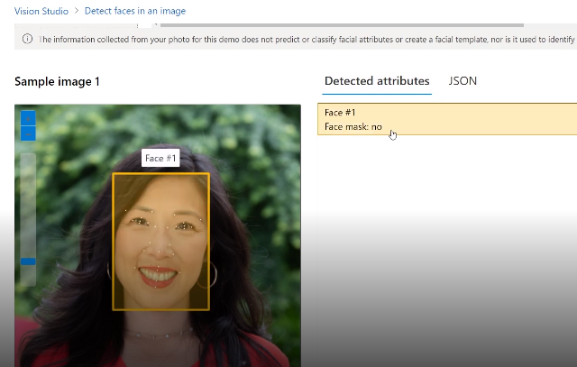
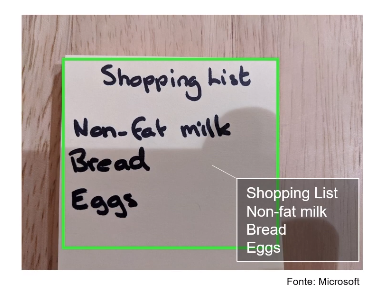
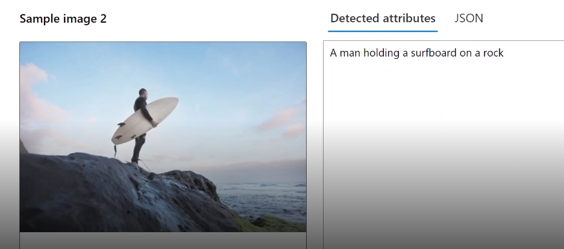
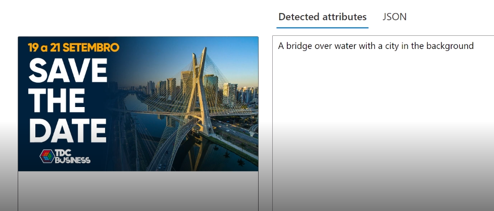

## Análise de imagens 4.0 com AI Viion Service

Os recursos incluem:

1. Personalização do modelo
2. Ler texto de imagens
3. Detecte pessoas em imagens
4. Gerar legendas de imagens
5. Detectar objetos
6. Marcar recursos visuais
7. Corte inteligente

entre outros

# na prática

## links auxiliares

https://aka.ms/ai900-face

https://aka.ms/ai900-ocr

https://aka.ms/ai900-image-analysis

## portal vision

https://portal.vision.cognitive.azure.com/gallery/featured

# face

o legal é que podemos usar esse mecanismo de detecção de face na nossa aplicação,
essa é uma das possibilidades.

# analise de documentos OCR

O OCR auxilia na detectar e localização de texto impresso e escrito à mão.
O OCR também extrai os texto das imagens de forma rápida e simples.

# Add captions to images

Adicionar sentenças descrevendo a imagem, isso é muito útil quando se quer adicionar acessibilidade em um site.

